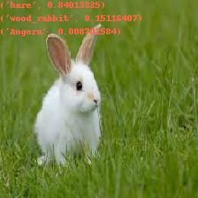
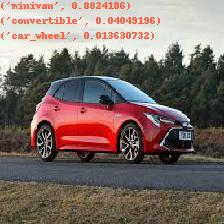

# Image classification with pre-trained keras ResNet50

The script `image_classification.py` takes as input a parameter with the path of an image.
The result is saved in image_predicted folder. Predicted objects are written on top of the processed image.

More information here:
https://keras.io/api/applications/

Code example:

`python image_classification.py images/laptop.jpeg`

Results:

